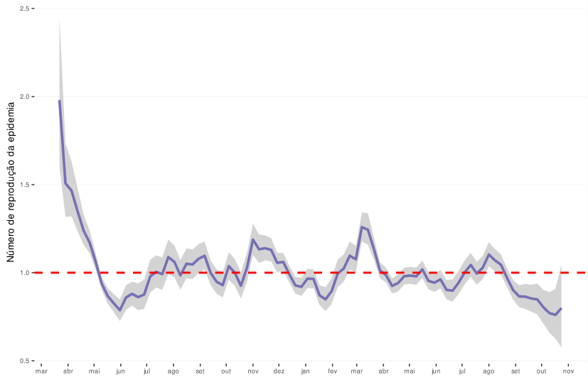

background_image: url(https://upload.wikimedia.org/wikipedia/commons/thumb/0/0b/Logo_SUS.svg/279px-Logo_SUS.svg.png)

```{r setup, include=FALSE}
options(htmltools.dir.version = FALSE)
knitr::opts_chunk$set(echo = FALSE)
# install.packages("devtools")
#devtools::install_github("gadenbuie/xaringanExtra")
#install.packages("fontawesome")
```

```{r xaringan-themer, include=FALSE, warning=FALSE}
library(xaringanthemer)

style_mono_accent(
  title_slide_text_color = "white",
  base_color = "#005BAB",
  inverse_header_color = "white",
  inverse_text_color = "white",
  header_h1_font_size = "2.25rem",
  header_h2_font_size = "2rem")
```

```{r xaringanExtra, echo=FALSE}
xaringanExtra::use_logo(image_url = "fig/oc.jpeg")
xaringanExtra::use_tile_view()
xaringanExtra::use_webcam()
```

## Quem somos?

+ O Observatório COVID19-BR é uma __iniciativa independente__ fruto do __trabalho conjunto e voluntário__ de seus participantes, que visa contribuir para a __análise científica__ e o __debate público__ em torno da pandemia SARS-COV2 no Brasil

--

+ Analisamos as tendências da pandemia, modelamos o efeito de diferentes cenários e medidas de contenção e discutimos políticas de saúde pública

--

+ Colaboramos com equipes das __Secretarias de Saúde__ de alguns __ municípios sentinela__

--

+ Interagimos com a imprensa, autarquias e público em geral através do nosso site, entrevistas, depoimentos e redes sociais

--

+ Hoje: mais de 60 pesquisadores em instituições brasileiras e mundiais. Equipe multidisciplinar: física, biologia, medicina, epidemiologia, imunologia, saúde pública, ciência política, comunicação científica

--

#### Acreditamos nos valores do diálogo de base científica, na ciência aberta e acessível, na reprodutibilidade das análises e na transparência dos dados.

---
## Analise de dados

__Grupo processamento inicial e _nowcasting___

Paulo Inácio Prado,
Renato Coutinho,
Rafael Lopes,
Tatiana Portella,
Sara Mortara,
Diogo Melo, 
Andrea Sánchez-Tapia

--

__Grupo de cálculo de R efetivo__

Flávia Marquitti,
Henrique Flores,
Rafael Lopes,
Renato Coutinho,
Diogo Melo,
Marcelo Borges,
Silas Poloni Lyra,
Tatiana Portella

--

__Grupo de modelagem matemática de diferentes cenários__

Caroline Franco, 
Leonardo Souto Ferreira,
Renato Coutinho, 
Roberto Kraenkel, 
Silas Poloni Lyra,
Vitor Sudbrack, 
Vitor Mori, 
Marcelo Eduardo Borges

--

__Manutenção do site__

Rafael Badain, Vitor Sudbrack, Renato Coutinho, Rafael Lopes, Flavia Ferrari


---
# Os dados de COVID-19 no Brasil


+ Sistema de vigilância epidemiológica:

  + __SIVEP-Gripe__. Casos de Síndrome Respiratória Aguda Grave (SARS), desde 2009 (H1N1) 
  + __eSUS-VE__. Casos suspeitos leves ("síndrome da gripe"), desde abril de 2020

--

+ Campos demográficos (anônimos), tipo de teste realizado, sintomas, resultados do teste

--

+ __Datas de início dos sintomas__, entrada no sistema, internação, evolução (alta/óbito), notificação e encerramento do caso

--

+ Cada município/estado tem seus próprios bancos de dados, limpando-so e desduplicando-os <!--Casos de pessoas que entram em alguns hospitais que primeiro entram no Sistema eSUS-VE como casos leves e depois pioram e entram no sistema SIVEP. -->

--

<center>

__Cenário complexo e diferentes níveis de detalhe com a escala geográfica__


---
## Algumas decisões de análise

+ __SIVEP-Gripe__ é mais preciso e tende a ser mais limpo <!-- e era o único que existia no início da pandemia -->

--

+ Devido à __falta de testes diagnósticos__, até 85% dos casos de SARS sem testes conclusivos podem ser COVID: __temos que analisar COVID e SARS__

--

+ Que data usar? Data da internação, data da notificação do caso?

--

+ Existe um __atraso inerente no sistema de vigilância__


---
class: hide_logo, middle 

```{r linha do tempo, out.width = 800, fig.align='center'}
knitr::include_graphics("https://covid19br.github.io/fig/folder_covid2-03.png")
```

Créditos: Camila Estevam, Vitor Mori

???
alt-text: uma figura com o cronograma de transmissão COVID19. Este slide mostra o atraso entre o momento em que a pessoa é infectada e apresenta os primeiros sintomas (3 a 5 dias) e o momento em que procura atendimento médico. O caso é confirmado vários dias após a infecção

---
class: hide_logo, middle 

```{r atrasos, out.width = 550, fig.align='center'}

```

Créditos: Rafael Lopes, Gustavo Burin

???
alt-text: um gif com várias curvas sucessivas do número de mortes relatadas (eixo y) por data da morte (eixo x). Todas as curvas mostram uma queda no final da série temporal, devido à atração na notificação e cada novo boletim (ou seja, cada nova curva na animação) adiciona mortes a toda a série temporal, indicando que ainda existem mortes antigas que entram no sistema muitos dias depois

---
# Corrigindo o atraso da notificação

+ "_Nowcasting_" por Bayesian _smoothing_: pacote `NobBS` (McGough et al. 2020)


```{r, out.width=700}

```

???
um fato chave em si mesmo
útil para calcular r efetivo

alt-text: uma curva do número de óbitos (no eixo y) por data da óbito, entre abril de 2020 e janeiro de 2021. A curva tem um pico por volta de julho-agosto e desde então voltou a cair, voltando aproximadamente ao final de novembro. Os últimos 60 dias da curva apresentam duas séries de pontos, os reportados, que mostram queda ao final da série (devido à atração na notificação) e os corrigidos por previsão a curto prazo, que mostram que o número provável de casos ao final da série é muito superior ao relatado e pode corresponder a uma segunda onda

---

## Grupo de R efetivo


+ __R efetivo__: um dos parâmetros-chave para entender a situação atual da pandemia: número de pessoas infectadas no tempo `t + 1` para cada pessoa infectada no tempo` t`

--

+ `R < 1` desaceleração, `R = 1` estabilidade, `R > 1` aceleração da transmissão

--

+ Pacote __EpiEstim__ (Cori 2020)

--

+ O grupo R efetivo do Observatório, foram incluídas alterações na forma de fazer esse cálculo, como:

--

  + Correção por _nowcasting_

--
 + Uma correção (projeção retroativa) para __estimar a data da infecção__ (antes do início dos sintomas) a partir da distribuição estatística do __tempo de incubação__ da doença (Lauer et al 2020)

--

Flávia Marquitti: `r fontawesome::fa("twitter", fill = "#005BAB")` [@flamarquitti](www.twitter.com/flamarquitti) 

---
## R efetivo de casos graves para Covid

+ Rio de Janeiro, RJ

```{r, out.width = 600, fig.align='center'}

```

---
class: hide_logo
background-image: url("https://www.r-project.org/logo/Rlogo.svg")
background-position: 80% 70%
background-size: 100px
## Fluxo de trabalho

```{r, out.width = 800, fig.align='center'}

```

--

Os usuários do site podem baixar dados brutos e processados, scripts e figuras https://github.com/covid19br/

???
Uma série de scripts R e bash que:
+ Detecta quando o banco de dados foi carregado
+ Verifica a __integridade__ das bases (que mudaram ao longo do tempo)
+ Realiza o _nowcasting_ de casos e mortes por SARS e casos COVID-19 confirmados
+ calcula o __R__ efetivo
+ Produz as __figuras__ e atualiza a página da web

---
# Escala espacial de análise

Análise em diferentes escalas espaciais:

+ Estados, Distritos Regionais de Saúde (DRS) do Estado de São Paulo, Municípios

--

+ Por que não fazer monitoramento individual dos 5.570 municípios do Brasil?

--

  + Alta demanda computacional

--

  + Muitos municípios com notificação muito baixa, sem hospitais ou unidades de terapia intensiva

--

+ __Falta de contexto__ para realizar esta análise

--

+ Preferimos: trabalhar diretamente com __municípios sentinela__ (possibilidade de melhor compreensão do contexto)

---
# Relacionamento com os municípios

Maria Amélia Veras, Rita Donalísio, Camila Estevam, Vitor Mori, Rafael Lopes, Sara Mortara, Paulo Inácio Prado, Andrea Sánchez-Tapia, Guiliano Boava, Leandro Garcia, Flavia Corrallo, Josimari Lacerda, Brigina Kemp, Alexandra Boing, Antonio Boing, Eleonora D'Orsi, Guilherme Moura, Maurício Magnani, Edson Júnior

+ Florianópolis (SC), Campinas (SP), Diadema (SP)

--

+ Cada um com sua __equipe de profissionais__, metodologia e __fluxo de trabalho independente__

--

+ Repositórios próprios, bancos de dados privados e confidenciais

--

+ Reuniões semanais ou quinzenais, algumas reuniões de todas as equipes

--

+ Troca de experiências com e entre profissionais do setor público de saúde

---
class: inverse, middle, center

# Outras análises do Observatório

---
class: hide_logo 
background-image: url("fig/CoMo-logo-large.png")
background-size: 200px
background-position: 95% 5%

## Modelagem matemática

+ Colaboração com o __CoMo Consortium__, Universidade de Oxford

--

+ Modelos matemáticos de propagação do vírus levando em consideração sua transmissibilidade, matrizes de contato e a estrutura etária da população.

--

+ Requer a classificação da população de interesse em categorias (__S__: suscetível, __E__: exposto, __I__: infectado, __H__: hospitalizado, __R__: recuperado, __D__: óbitos)

--

+ Estratificado por idade

--

+ Para fazer esses modelos, precisamos dos __melhores dados possíveis__: escala espacial mais fina (capital de São Paulo, Porto Alegre e Goiânia)

--

<br>
<br>
<br>

CoMo Consortium: `r fontawesome::fa("twitter", fill = "#005BAB")` [@ComoConsortium](www.twitter.com/ComoConsortium) https://como.bmj.com/


---
## Modelagem matemática

```{r, out.width=900, fig.align='center'}

```

Franco et al. 2021. _Percolation across households in mechanistic models of non-pharmaceutical interventions in SARS-CoV-2 disease dynamics._ (_preprint_)

+ Contato: Caroline Franco `r fontawesome::fa("twitter", fill = "#005BAB")`  [@_francocarol](www.twitter.com/_francocarol) 

???
 
+ Um sistema de equações diferenciais onde a resposta é casos delta/delta t
+ O efeito das medidas não-farmacológicas para redução da transmissão do vírus pode ser modelado: se houver __intervenções não-farmacológicas para redução da transmissão__ o número de suscetíveis não diminui, mas a transmissão (matriz de contato) é alterada

---
class: hide_logo 
background-image: url("fig/mod_dinamica.png")
background-size: 150px
background-position: 95% 5%
## Modelagem matemática

+ Efeito da reabertura de escolas e rastreio de contatos


```{r, out.height = 400,  out.width = 600, fig.align='center'}

```

+ Borges et al. 2021. _Modeling the impact of school reopening and contact tracing strategies on Covid-19 dynamics in different epidemiologic settings in Brazil._ (_preprint_)

---
class: hide_logo 
background-image: url("fig/mod_dinamica.png")
background-size: 150px
background-position: 95% 5%

## Modelagem matemática

+ Efeito da reabertura de escolas e rastreio de contatos


```{r, out.height = 400, out.width = 600, fig.align='center'}

```

+ Borges et al. 2021. _Modeling the impact of school reopening and contact tracing strategies on Covid-19 dynamics in different epidemiologic settings in Brazil._ (_preprint_)

---
## Modelagem matemática

+ Estimativa de parâmetros de transmissão de novas variantes (Gamma)


```{r, out.width=500, fig.align='center'}

```   

Coutinho et al. 2021. _Model-based evaluation of transmissibility and reinfection for the P. 1 variant of the SARS-CoV-2._ (_aceito_)

---
## Modelagem matemática

+ Estimativa de parâmetros de transmissão de novas variantes (Gamma)


```{r, out.width=300, out.width=400, fig.align='center'}

```   

Coutinho et al. 2021. _Model-based evaluation of transmissibility and reinfection for the P. 1 variant of the SARS-CoV-2._ (_aceito_)
---
## Modelagem matemática

+ Estimativa do intervalo ótimo de dosagens de vacinas


```{r, out.height=210, out.width = 550, fig.align='center'}


```   

Ferreira et al. 2021. _Assessing optimal time between doses in two-dose vaccination regimen in an ongoing epidemic of SARS-CoV-2._ (_preprint_)

---
## Grupo de Epidemiologia, Saúde Pública e Políticas Públicas

Maria Amélia Veras, Márcia Castro, Ana Ribeiro, Verônica Coelho, Rita Donalísio, Camila Estevam, Lorena Barberia, Tatiane Moraes, Natalia Moreira, Gabriela Lotta, Janaína Maudonnet, José Cássio de Mores, Brigina Kemp

--

+ __Robustez__ e __contexto__ para análise de dados

--

+ Análise socioeconômica e de políticas públicas

--

+ Organização de palestras semanais com grupos convidados

--

+ Entrevistas para televisão e rádio, "lives", webinars, cursos de pós-graduação


???
+ Apresentação de grupos convidados <! - (que às vezes ficam <3) ->
+ Discussão sobre assuntos de interesse
       + Reabertura de faculdades e escolas
       + Plano Nacional de Vacinação
       + Vacinas
       + Modelos matemáticos


---
## Equipe de comunicação

Flávia Ferrari, Rafael Lopes, Laura Segovia Tercic, Vitor Mori, Marcelo Kubo, Monica de Bolle

--

+ Redação coletiva de textos e tópicos do twitter

--

+ Criação de animações e infográficos

--

+ Criação e tradução de material de divulgação

--

+ Contatos com a imprensa

--

+ Cartas abertas em jornais

--

+ __Contato direto com o público__ via redes sociais

--

+ Participação em campanhas de saúde pública: __#AdiaENEM__, [__#TodosPelasVacinas__](https://twitter.com/search?q=%23todospelasvacinas&src=typeahead_click), [http://www.todospelasvacinas.info/](http://www.todospelasvacinas.info/)


---
# Lições

União faz a força: trabalho interdisciplinar e colaborativo <!-- ninguém isolado faria uma fração do que estamos fazendo, e todo colaborador, independente da fase da carreira, conta -->

--

+ __Organização horizontal__. Tomada de decisão, redação de textos, grupos de trabalho, apoio no grupo, confiança nos critérios dos outros <!-- "um rizoma anarco-pacifista" -->


--

+ O uso de ferramentas de código aberto, a reprodutibilidade das análises e a transparência dos dados: __ciência aberta__ 

--

+ `R` como uma língua franca: permite-nos comunicar entre áreas do conhecimento e fases de carreira <!-- um laboratório de aprendizagem coletiva-->

--

+ Compromisso com o debate público informado, responsabilidade na relação com os gestores da saúde, a imprensa e o público em geral: __cidadania científica__ (_cidadania científica_)

--

+ __Apoio à ciência brasileira__ contra cortes, ataques abertos e desinformação (por exemplo, movimento antivacinas)

--

+ __Defesa do Sistema Único de Saúde__ <!-- sem o qual a situação seria muito pior 7 milhões de casos, 200 mil mortes --> `# DefendaoSUS`


---
class: middle, center
# Obrigado!

`r fontawesome::fa("home")` Página web: [https://covid19br.github.io/](https://covid19br.github.io/)

`r fontawesome::fa("github")` GitHub: [https://github.com/covid19br/](https://github.com/covid19br/)  
`r fontawesome::fa("paper-plane")`  [obscovid19br@gmail.com](mailto:obscovid19br@gmail.com)  
`r fontawesome::fa("instagram")` Instagram: [@obscovid19br](www.instagram.com/obscovid19br) 
`r fontawesome::fa("twitter")` Twitter: [@obscovid19br](www.twitter.com/obscovid19br)   
`r fontawesome::fa("facebook")`  [https://www.facebook.com/obscovid19br](https://www.facebook.com/obscovid19br)

---
## Membros do Observatório COVID19-BR

```{r}

```

---
## Membros do Observatório COVID19-BR

```{r}

```

---
## Membros do Observatório COVID19-BR

```{r}

```

---
## Membros do Observatório COVID19-BR

```{r}

```

---
## Membros do Observatório COVID19-BR

```{r}

```

---
## Membros do Observatório COVID19-BR

```{r}

```

---
## Membros do Observatório COVID19-BR

```{r}

```

---
class: middle, center
# Obrigado!

`r fontawesome::fa("home")` Página web: [https://covid19br.github.io/](https://covid19br.github.io/)

`r fontawesome::fa("github")` GitHub: [https://github.com/covid19br/](https://github.com/covid19br/)  
`r fontawesome::fa("paper-plane")`  [obscovid19br@gmail.com](mailto:obscovid19br@gmail.com)  
`r fontawesome::fa("instagram")` Instagram: [@obscovid19br](www.instagram.com/obscovid19br) 
`r fontawesome::fa("twitter")` Twitter: [@obscovid19br](www.twitter.com/obscovid19br)   
`r fontawesome::fa("facebook")`  [https://www.facebook.com/obscovid19br](https://www.facebook.com/obscovid19br)

---
class: inverse


---
class: hide_logo
background-image: url("fig/Logo_SUS.png")
background-size: 200px
background-position: 95% 5%


# Sistema de saúde no Brasil

+ País continental
+ ~210 milhões de pessoas
+ Desigualdade e heterogeneidade, Sistema Federal (27 Estados)
+ Constituição Federal de 1988: __Sistema Único de Saúde__
+ Sistema __Universal, Público e Gratuito__
+ Unidades básicas de saúde, hospitais, rede de __Agentes Comunitários de Saúde (ACS) __ na frente do serviço público, rede de Unidades de Atenção Primária (UPA), hospitais + convênios com a rede privada de saúde
+ __Longa história de resposta efetiva a pandemias/epidemias__. ZIKV em 2014. AIDS
+ Tradição de pesquisa em saúde pública e doenças tropicais (FIOCRUZ, Instituto Butantán) e __capacidade de produção de vacinas__ (CORONAVAC)
+ Um dos maiores programas de vacinação do mundo: 154 milhões com ao menos uma dose desde 17 de janeiro, 113 milhões com esquema vacinal completo (até 28 de outubro)

